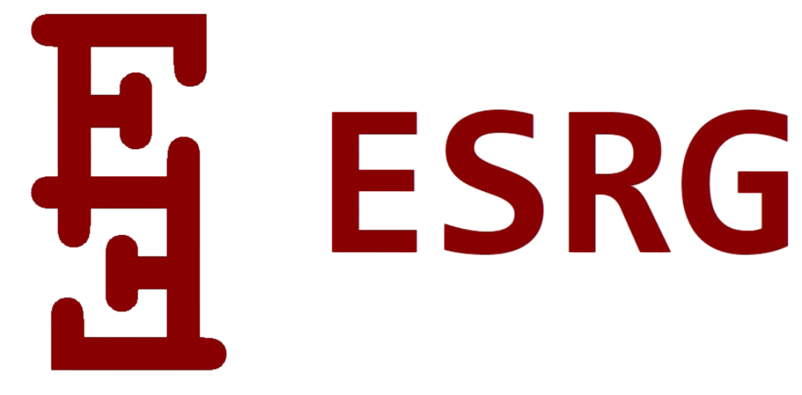

 

# Guía para Contribuyentes

Gracias por tu interés en formar parte del desarrollo y evolución de **Bintary Converter**, una herramienta concebida con fines educativos y de apoyo técnico para estudiantes, docentes y personas interesadas en la comprensión de sistemas numéricos y lógica computacional. Esta guía tiene como objetivo establecer un marco claro, respetuoso y ético para quienes deseen colaborar activamente en el proyecto.

---

## Propósito del Proyecto

Bintary Converter ha sido diseñado como un recurso de consulta pedagógica, cuya principal finalidad es facilitar el entendimiento de los procesos de conversión numérica entre diferentes sistemas de numeración, especialmente en el contexto de la enseñanza de fundamentos informáticos.  

El software **no** ha sido concebido para su uso comercial o industrial, y su distribución está regulada por una licencia de uso específica que debe ser respetada por todas las personas que accedan, utilicen o modifiquen el código fuente.  
> Para detalles completos sobre permisos, restricciones y condiciones legales, consulte el archivo **[LICENSE.md](LICENSE.md)**.

---

## Lineamientos Generales para Contribuir

El proyecto está abierto a la participación de desarrolladores, docentes, estudiantes y entusiastas de la tecnología educativa que deseen aportar desde una perspectiva constructiva y respetuosa.  

Se valoran especialmente aquellas contribuciones que ayuden a enriquecer la calidad técnica del código, así como las que fortalezcan su potencial didáctico y su accesibilidad para una audiencia diversa.

Las personas interesadas en colaborar pueden hacerlo a través de:

- Mejoras en la implementación actual.  
- Propuestas de nuevas funciones.  
- Corrección de errores.  
- Ampliación de la documentación.  
- Traducciones.  
- Integración de una interfaz gráfica que respete la identidad del proyecto.  
- Generación de materiales que apoyen el uso del programa en contextos formativos.

Cualquier tipo de aporte será bienvenido siempre que se mantenga el espíritu original del proyecto y se respeten los derechos de autor y los límites establecidos en la **Licencia de Uso del Software**.  

La redistribución de versiones modificadas está permitida únicamente si se conserva de forma íntegra la licencia original y se reconoce visiblemente la autoría de **ESRG**. Consulte **[LICENSE.md](LICENSE.md)** para ver las condiciones exactas de redistribución y créditos requeridos.

---

## Proceso de Colaboración

Si deseas realizar una contribución técnica, te recomendamos que primero explores el repositorio y te familiarices con su estructura, estilo y principios lógicos.  

Puedes clonar o bifurcar el proyecto, desarrollar tu propuesta de mejora en una rama separada, y luego solicitar su integración a través de un **Pull Request**.

> **Importante:** **Cada contribución debe ser revisada y aprobada por ESRG antes de ser integrada al proyecto.**

En el Pull Request, es fundamental que expliques de forma clara:

- El propósito de tu cambio.  
- Su justificación técnica o pedagógica.  
- Cualquier otro detalle relevante para su evaluación.

El código que envíes debe seguir las buenas prácticas del lenguaje de programación utilizado, mantener la legibilidad y coherencia del proyecto, e incluir comentarios explicativos si introduces funciones o estructuras complejas.  

La calidad del código es tan importante como la intención pedagógica detrás de tu propuesta.

Por otra parte, si lo que deseas es comunicar una idea, reportar un error o plantear una sugerencia, puedes abrir un **Issue** en el repositorio.  

Se agradecen especialmente las observaciones bien argumentadas que busquen el mejoramiento continuo del proyecto.

---

## Método de Revisión y Aprobación

- **Pull Requests (PR):** ESRG revisa PRs en GitHub; puede aprobar, solicitar cambios o rechazar. No se debe fusionar ningún PR sin la aprobación explícita de ESRG.  
- **Issues de alto impacto:** Se recomienda abrir un Issue antes de desarrollar cambios significativos; ESRG evaluará la propuesta y orientará su implementación.  
- **Bloqueo de commits directos:** No hacer `push` directo a `main`/`master`. Todo cambio debe pasar por una rama y un PR.  
- **Materiales gráficos y pedagógicos:** También requieren revisión por ESRG antes de integrarse.

---

## Respeto por la Identidad del Proyecto

El diseño visual, la lógica de interacción y el enfoque educativo de **Bintary Converter** son parte de su identidad conceptual y técnica.  

Cualquier modificación propuesta debe ser coherente con estos elementos y no debe reproducir, imitar ni apropiarse del estilo de la interfaz gráfica original, a menos que se cuente con autorización expresa del autor.

Las contribuciones deben evitar cambios que alteren el propósito o desdibujen los valores fundamentales del software. Esto incluye, pero no se limita a:

- Su orientación no comercial.  
- Su rol como recurso educativo libre.  
- Su estructura lógica basada en principios de claridad, simplicidad y utilidad pedagógica.

---

## Autoría y Reconocimiento

La autoría del proyecto corresponde a **ESRG**, quien conserva todos los derechos sobre el código, su diseño, su estructura lógica y su presentación general.  

Las personas que colaboren deben reconocer explícitamente esta autoría en cualquier derivado, y abstenerse de modificar o eliminar los créditos incluidos en el código fuente, la documentación o la interfaz.

Queda estrictamente prohibido declarar, de forma implícita o explícita, que el software ha sido desarrollado por terceros o atribuirse su creación.  

Cualquier forma de representación indebida será considerada una infracción grave de los términos establecidos en la licencia. Para conocer las sanciones, limitaciones o condiciones de atribución concreta, consulte **[LICENSE.md](LICENSE.md)**.

---

## Sobre la Aceptación de los Términos

Al participar en este proyecto mediante modificaciones, propuestas o cualquier tipo de interacción con el código fuente, se entiende que aceptas plena e incondicionalmente los términos establecidos en la **Licencia de Uso**.  

En caso de no estar de acuerdo con dichos términos, se solicita no continuar con ningún proceso de contribución ni redistribución del software.

La participación en este proyecto implica un compromiso con la ética del desarrollo colaborativo, el respeto a la propiedad intelectual y el fortalecimiento de herramientas libres con valor formativo. Consulte **[LICENSE.md](LICENSE.md)** para información legal y condiciones específicas.

---

## Consideraciones Finales

Las contribuciones son revisadas cuidadosamente con el fin de preservar la coherencia, integridad y calidad del proyecto.  

Agradecemos profundamente a quienes invierten su tiempo y conocimiento en enriquecer esta iniciativa.

Con cada aporte, grande o pequeño, estás ayudando a que **Bintary Converter** sea una mejor herramienta para enseñar, aprender y explorar conceptos fundamentales de la informática.  

Te invitamos a participar con responsabilidad, creatividad y respeto.

&nbsp;&nbsp;&nbsp;&nbsp;&nbsp;&nbsp;&nbsp;&nbsp;&nbsp;  

&nbsp;&nbsp;&nbsp;&nbsp;&nbsp;&nbsp;&nbsp;&nbsp;&nbsp;&nbsp;&nbsp;&nbsp;&nbsp;&nbsp;&nbsp;&nbsp;&nbsp;&nbsp; **El que aporta, no entrega líneas, sino huellas.**  
&nbsp;&nbsp;&nbsp;&nbsp;&nbsp;&nbsp;&nbsp;&nbsp;&nbsp;&nbsp;&nbsp;&nbsp;&nbsp;&nbsp;&nbsp;&nbsp;&nbsp;&nbsp; El código se compila, pero la intención persiste.  
&nbsp;&nbsp;&nbsp;&nbsp;&nbsp;&nbsp;&nbsp;&nbsp;&nbsp;&nbsp;&nbsp;&nbsp;&nbsp;&nbsp;&nbsp;&nbsp;&nbsp;&nbsp; Lo invisible guía al cambio: no siempre se ve quién siembra, pero siempre florece algo.

&nbsp;&nbsp;&nbsp;&nbsp;&nbsp;&nbsp;&nbsp;&nbsp;&nbsp; 

