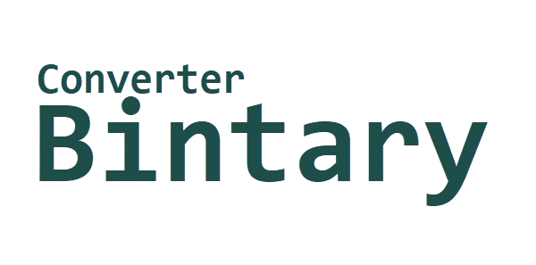

 

 

# Bintary Converter  

**Herramienta especializada para conversiones precisas entre sistemas binario y decimal.**

**Bintary Converter** es una herramienta técnica desarrollada para realizar **conversiones precisas entre números en sistema binario y sistema decimal.** Su diseño minimalista y enfoque funcional lo convierten en una solución eficiente tanto para entornos educativos como profesionales.

El software permite al usuario ingresar un valor en cualquiera de los dos sistemas numéricos y obtener su equivalente de forma inmediata, evitando pasos intermedios o cálculos manuales propensos a errores. Su uso es especialmente útil para estudiantes de informática, docentes, desarrolladores y técnicos que requieran validar conversiones numéricas como parte de sus procesos de aprendizaje, enseñanza o desarrollo de sistemas.

Bintary Converter ha sido optimizado para ofrecer un alto rendimiento con una interfaz limpia, sin elementos innecesarios, facilitando una experiencia de uso directa y sin distracciones. Está pensado como una herramienta de consulta rápida, ideal para complementar actividades relacionadas con lógica computacional, arquitectura de computadores y programación de bajo nivel.

Además, su diseño multiplataforma permite integrarlo fácilmente en diferentes entornos de trabajo, ya sea como herramienta de escritorio autónoma o como complemento en laboratorios educativos y técnicos. Su portabilidad en formato .jar lo hace compatible con cualquier sistema operativo que soporte Java, eliminando barreras de instalación o dependencias externas.

Bintary Converter no solo cumple una función utilitaria, sino que también promueve la comprensión conceptual de los sistemas numéricos y su relevancia en el ámbito del desarrollo de software y la electrónica digital. Su enfoque pedagógico lo convierte en un recurso accesible para todo tipo de usuarios, desde principiantes hasta profesionales avanzados que requieran agilidad en sus tareas cotidianas

## Contenido

[Diseñado para](#diseñado-para) Público objetivo y principales casos de uso de la herramienta.  
[Características principales](#características-principales) Lista de funciones clave y ventajas del software.  
[Requisitos del sistema](#requisitos-del-sistema) Dependencias necesarias para ejecutar la aplicación.  
[Instrucciones de uso](#instrucciones-de-uso) Guía rápida para iniciar el programa desde consola o doble clic.  
[Proyecto y colaboración](#proyecto-y-colaboración) Estructura del repositorio, licencia, autoría y formas de contribuir.  
[Descargar](#Descargar-Bintary-Converter) Enlaces oficiales para obtener la última versión del software.  

## Diseñado para:

- Estudiantes de secundaria, universidades o formación técnica.  
- Profesores y formadores que enseñan sistemas numéricos.  
- Personas autodidactas que desean entender el funcionamiento lógico binario.  
- Uso como utilidad de conversión técnica rápida.  

## Características principales

- Conversión directa de números binarios a decimales (base 2 ➝ base 10).  
- Soporte para números con signo mediante **complemento a dos**.  
- Detección automática del tamaño en bits según la longitud del binario ingresado.  
- Modo configurable:  
  - **Sin signo** (valores siempre positivos).  
  - **Con signo** (interpretación en complemento a dos).  
- Interfaz por consola simple e intuitiva.  
- Compatible con cualquier sistema operativo que soporte **Java**.  
- No requiere instalación ni librerías externas.  
- Rápido, liviano y seguro.  
- Ideal para uso **offline** o como herramienta portátil (**.jar ejecutable**).  

## Requisitos del sistema

**Java Runtime Environment (JRE) 8 o superior**.  
Para ejecutar **Binary Converter**, necesitas tener instalado **Java Runtime Environment (JRE) en su versión 8 o superior**.  

Puedes comprobar si ya tienes Java instalado abriendo una terminal o consola y ejecutando:

```bash
java -version
```
> Si el comando devuelve información sobre la versión, significa que Java está correctamente instalado. En caso contrario, puedes descargarlo desde el sitio oficial de Oracle: https://www.oracle.com/java/technologies/javase-downloads.html

También puedes optar por una alternativa gratuita como OpenJDK, compatible y ampliamente utilizada en entornos de desarrollo profesional y educativo.

## Instrucciones de uso
### Ejecución rápida
Puedes ejecutar Bintary Converter de manera sencilla utilizando cualquiera de las siguientes opciones:  
**- Opción 1: Doble clic**  
En la mayoría de los sistemas operativos con Java instalado, basta con hacer doble clic sobre el archivo Bintary.jar para iniciar la aplicación de inmediato, sin necesidad de configuraciones adicionales.  
**- Opción 2: Desde consola o terminal**  
Si prefieres usar la línea de comandos, navega hasta la carpeta donde se encuentra el archivo y ejecuta:

```bash
java -jar Bintary.jar
```
Esta opción es útil para entornos técnicos o cuando deseas integrar el programa en flujos de trabajo más personalizados.


 ---

## Proyecto y colaboración

 

### Estructura del proyecto

La siguiente estructura representa la organización del proyecto **Bintary Converter**, incluyendo los archivos principales y sus propósitos dentro del repositorio:

```bash
BintaryConverter/
├── .gitignore         # Ignora archivos y carpetas en el control de versiones
├── CODEBASE.md        # Documentación de la estructura del repositorio
├── CONTRIBUTING.md    # Guía para contribuir al proyecto
├── LICENSE.md         # Información de la licencia del proyecto
├── README.md          # Descripción general y guía de uso
├── manifest.mf        # Manifest del proyecto (configuración principal)
├── assets/            # Archivos activos
└── src/               # Código fuente
```

### Licencia

Este proyecto está protegido por los términos establecidos en el archivo [`LICENSE.md`](./LICENSE.md), el cual regula detalladamente las condiciones de uso, modificación y distribución del software.

Se autoriza su uso libre exclusivamente con fines **educativos, investigativos o de consulta técnica**, tanto en contextos personales como académicos. Los usuarios pueden estudiar el código, ejecutarlo y adaptarlo dentro de estos límites, siempre que se respeten los lineamientos establecidos en la licencia.

**Importante:**  
No se permite la utilización, redistribución o integración del software con fines **comerciales o lucrativos**, salvo autorización expresa, previa y por escrito del autor. Cualquier uso no autorizado fuera del ámbito permitido será considerado una violación a los derechos de propiedad intelectual.

Para mayor claridad sobre los alcances y restricciones de la licencia, se recomienda consultar directamente el archivo [`LICENSE.md`](./LICENSE.md).


### Proyecto relacionado

**Zarykon Project** es una plataforma modular orientada al estudio y desarrollo de herramientas relacionadas con los sistemas numéricos, las conversiones entre bases y los fundamentos de la lógica computacional. Su objetivo es proporcionar recursos accesibles, funcionales y educativos para estudiantes, desarrolladores y entusiastas de la programación.

### Autor y contacto

Este software ha sido íntegramente desarrollado por **ESRG**, como parte de una iniciativa orientada a fortalecer el acceso a herramientas didácticas en el ámbito de la computación, la lógica numérica y la programación.

Para consultas relacionadas con el uso del software, sugerencias de mejora, reportes de errores, solicitudes de colaboración o cualquier otro asunto pertinente, puedes comunicarte directamente con el autor a través del siguiente medio:

- Correo electrónico: [esrg.es@gmail.com](mailto:esrg.es@gmail.com)

Asimismo, si deseas contribuir al desarrollo del proyecto o plantear ideas públicamente, puedes abrir un *Issue* en el repositorio oficial en GitHub. Todas las propuestas serán revisadas con atención y respeto, priorizando aquellas que estén alineadas con los fines educativos y no comerciales del proyecto.

El diálogo abierto, respetuoso y colaborativo es bienvenido. No dudes en ponerte en contacto si consideras que puedes aportar a la evolución de esta herramienta o si simplemente tienes interés en su aplicación y desarrollo.


### Contribuciones

Este proyecto está abierto a la participación de desarrolladores, educadores y entusiastas que deseen aportar a su mejora y evolución.  
Se valoran especialmente las contribuciones que estén orientadas al fortalecimiento del enfoque técnico, educativo y formativo del software.

Puedes contribuir en cualquiera de las siguientes formas:

- Mejorando el código fuente existente mediante optimizaciones, refactorizaciones o correcciones.  
- Ampliando las funcionalidades, por ejemplo, añadiendo soporte para la conversión a otras bases numéricas (octal, hexadecimal, etc.).  
- Incorporando una interfaz gráfica de usuario (GUI) que facilite la experiencia interactiva.  
- Traduciendo la aplicación a otros idiomas, con el fin de hacerla accesible a un público más amplio.  
- Proponiendo o implementando mejoras orientadas a la enseñanza o al análisis técnico del contenido.

Las contribuciones pueden realizarse mediante la creación de un **Pull Request** o la apertura de un **Issue** en el repositorio oficial, indicando claramente el objetivo del cambio o mejora propuesto.

> **Importante:** **Cada contribución debe ser revisada y aprobada por ESRG antes de ser integrada al proyecto.**

Para mayor claridad sobre las formas de participación, lineamientos de colaboración y tipos de contribuciones aceptadas, se recomienda consultar directamente el archivo [CONTRIBUTING.md](CONTRIBUTING.md).

### Condiciones para contribuir

Este proyecto acepta aportes bajo los términos definidos en la [Licencia de Uso](./LICENSE.md). En consecuencia, toda contribución debe observar las siguientes condiciones:

- El uso del software y de sus contribuciones debe estar restringido exclusivamente a **fines educativos, técnicos o de investigación**, sin propósitos comerciales.  
- No se permite la inclusión de este software o sus derivados en proyectos de tipo **comercial o lucrativo** sin la autorización previa, expresa y por escrito del autor.  
- Toda modificación, extensión o adaptación debe conservar **íntegramente los créditos originales**, así como respetar la estructura lógica y los lineamientos visuales establecidos en el proyecto.  
- Las contribuciones no deben vulnerar los principios de autoría, originalidad y uso legítimo definidos en la licencia del software.

Para resolver dudas, plantear sugerencias o comunicarte directamente con el autor, puedes escribir a: [esrg.es@gmail.com](mailto:esrg.es@gmail.com).

Tu participación es bienvenida, siempre que se ajuste a los fines académicos, éticos y colaborativos que definen la esencia de este proyecto.


---
 
## Descargar Bintary Converter

 


[](https://www.java.com/es/download/)

La aplicación está disponible para su descarga como un archivo comprimido en formato .zip, el cual contiene todo lo necesario para ejecutar Bintary Converter sin configuraciones adicionales. Al descomprimir el paquete, encontrarás el archivo ejecutable .jar, junto con los recursos complementarios del proyecto, como gráficos, configuraciones y documentación básica.

Una vez extraído el contenido, puedes abrir directamente la aplicación haciendo doble clic en el archivo .jar, siempre que tengas Java instalado en tu sistema. Esta distribución está pensada para ofrecer una experiencia sencilla y rápida, permitiendo que cualquier usuario pueda comenzar a utilizar Bintary Converter de inmediato.

|| **VERSIÓN** 2.0 Java |
|-|-|
|  **Descargar**  |  https://drive.google.com/file/d/1g490RnvadfHcJrEtdTB9TyWQ9y6eZzFP/view?usp=sharing  |
|  **Descargar**  |  https://www.mediafire.com/file/6j0ei0edjvuldhc/Bintary_Converter_%255BVersi%25C3%25B3n_2.0_Java%255D.zip/file   | 
|  **Descargar**  |  https://mega.nz/file/jSxkyART#198ps9nPXyZF4YdKNNWF5pqZ_Uy22sDiuSAuybNwybY  |

>⚠️ **Bintary Converter** requiere tener instalado **Java 8 JRE** (Java Runtime Environment) o una versión superior para poder ejecutarse correctamente.
>
>*Si aún no tienes Java instalado, puedes descargar el JRE desde los siguientes enlaces oficiales:*  
>🔗 [Descargar Java 8 (JRE - Oracle)](https://www.oracle.com/java/technologies/javase/javase8-archive-downloads.html)  
>🔗 [Alternativa: Temurin JRE 8 (Eclipse Adoptium)](https://adoptium.net/temurin/releases/?version=8)
>
> Asegúrate de instalar la versión correspondiente a tu sistema operativo (Windows, macOS o Linux) y configurar correctamente las variables de entorno si es necesario (`PATH`).


---

   

&nbsp;&nbsp;&nbsp;&nbsp;&nbsp;&nbsp;&nbsp;&nbsp;&nbsp; Reducimos la creación de DIOS a términos simples,  
&nbsp;&nbsp;&nbsp;&nbsp;&nbsp;&nbsp;&nbsp;&nbsp;&nbsp; como si lo inabarcable pudiera domesticarse en lenguaje humano.  


